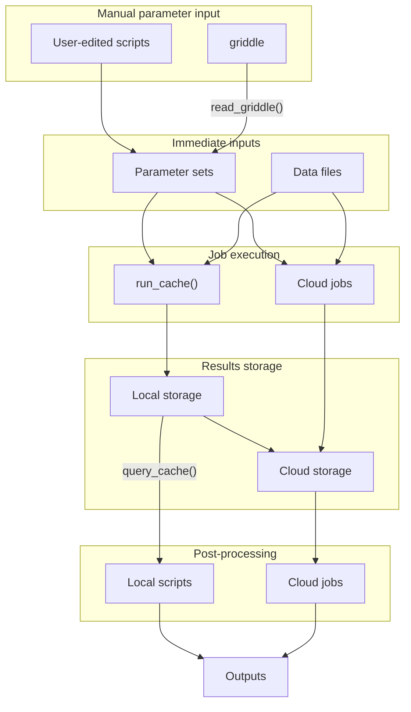

# griddler

- Source: <https://github.com/CDCgov/pygriddler/>
- Issues: <https://github.com/CDCgov/pygriddler/issues>
- Documentation: <https://cdcgov.github.io/pygriddler/>

## Griddles

A _griddle_ is an intuitive file format for specifying lists of parameter sets. The syntax is inspired by the ["matrix" strategy](https://docs.github.com/en/actions/using-workflows/workflow-syntax-for-github-actions#jobsjob_idstrategymatrix) in GitHub Workflow files.

The griddle format assumes that parameters come in three flavors:

- Baseline: You want these parameters in common across most iterations of your simulation.
- Grid: You want to perform a Cartesian product over lists of values for some parameters.
- Nested: For certain combinations of "gridded" parameters, you want to specify additional parameters, potentially overwriting the baseline parameters.

The griddle format is easy to read and write. See ["The griddle format"](griddle.md) for a complete specification of the format along with examples.

See the [API reference](reference.md) for more details.

## Overview



## Parsing griddles

At the command line, `griddler parse < griddle.yaml > parameter_sets.yaml` will read a griddle and output a YAML file. This output file is a list of named lists. Each named list is a parameter set, one for each element of the grid.

In a script, the same could be accomplished with:

```python
parameter_sets = griddler.griddle.read("griddle.yaml")

with open("parameter_sets.yaml", "w") as f:
    yaml.dump(parameter_sets, f)
```

## Running a function and "squashing" results

Given

- a function, say `simulate()`, that takes a parameter set and returns a [polars DataFrame](https://docs.pola.rs/py-polars/html/reference/dataframe/index.html), and
- a list of parameter sets, such as from [`griddler.griddle.read`][],

then [`griddler.run_squash(simulate, parameter_sets)`](reference.md#griddler.run_squash) will return a "squashed" version of the results. This is a single DataFrame consisting of the other DataFrames, vertically concatenated.

If `add_parameters=True` and `parameter_columns=None` (which is the default), then each resulting DataFrame has all the input parameters. This will only work if all the parameters have scalar values that can be coerced with [`pl.lit()`](https://docs.pola.rs/api/python/stable/reference/expressions/api/polars.lit.html). A subset of parameters can be added using `parameter_columns`.

If `add_hash=True` (which is the default), then a column (with name equal to `hash_column`, which is `"hash"` by default) with the parameter set hash will also be added.

## Running a function with replicates

Given

- a function, say `simulate()`, like in the example above, and
- a list of parameter sets, as above, but with each parameter set having keys `"n_replicates"` and `"seed"`,

then [`replicated(simulate)`](reference.md#griddler.replicated) is itself a function, with the same signature as `simulate()`. It removes the `"n_replicates"` and `"seeds"` parameters from each parameter set, sets the seed with [`random.seed()`](https://docs.python.org/3/library/random.html#random.seed), and then runs `simulate()` on the remaining parameters `n_replicate` times. The results gets squashed with a column `"replicate"` (or whatever name you specify).
